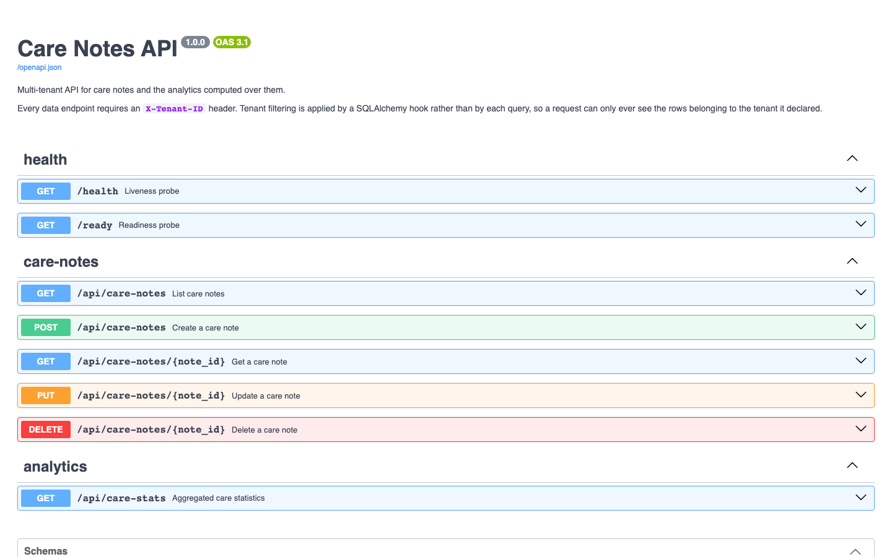
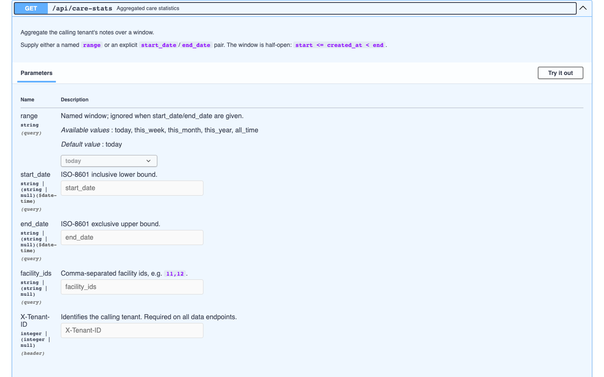
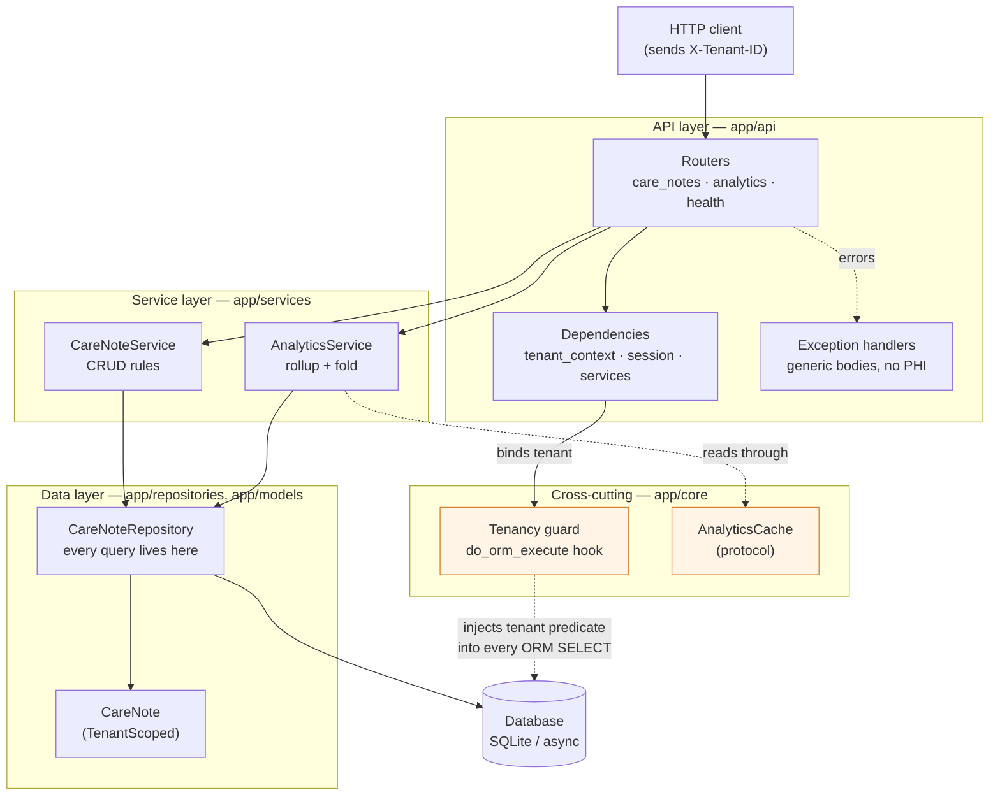
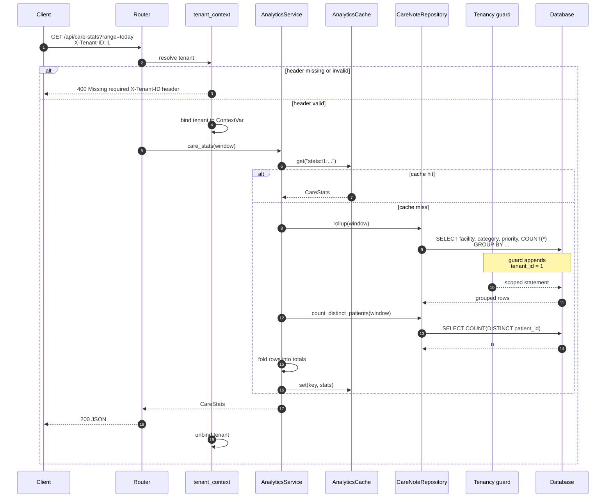

# Care Notes API

A multi-tenant FastAPI service that stores care notes for several healthcare
organisations in one database and computes aggregate statistics over them.
Several tenants share a table, so the design problem is isolation: tenant
filtering is applied by a SQLAlchemy hook rather than by each query, which
makes "somebody forgot the `WHERE tenant_id`" unexpressible rather than
merely unlikely.

Built as a backend take-home. It is deliberately small: a CRUD resource, an
analytics endpoint, and the plumbing to make both correct under multi-tenancy.

---

## Captured output

Everything below is real output from the container started by
`docker compose up --build`, seeded with 20,000 synthetic notes across three
tenants. There is no UI; the interactive OpenAPI page the service publishes is
shown at the end.

**Two tenants ask the same question and get their own answer.** Tenant 1 owns
facilities 11-14, tenant 2 owns 21-24. Neither appears in the other's rollup:

```console
$ curl -s -H 'X-Tenant-ID: 1' 'http://localhost:8160/api/care-stats?range=all_time'
{
    "tenant_id": 1,
    "total_notes": 6672,
    "unique_patients": 100,
    "avg_notes_per_patient": 66.72,
    "by_category": { "medication": 2187, "observation": 2188, "treatment": 2297 },
    "by_priority": { "1": 1353, "2": 1328, "3": 1316, "4": 1344, "5": 1331 },
    "by_facility": { "11": 1682, "12": 1674, "13": 1692, "14": 1624 },
    "date_range": { "start": null, "end": null }
}

$ curl -s -H 'X-Tenant-ID: 2' 'http://localhost:8160/api/care-stats?range=all_time'
{
    "tenant_id": 2,
    "total_notes": 6571,
    "unique_patients": 100,
    "avg_notes_per_patient": 65.71,
    "by_category": { "medication": 2190, "observation": 2214, "treatment": 2167 },
    "by_priority": { "1": 1282, "2": 1342, "3": 1352, "4": 1294, "5": 1301 },
    "by_facility": { "21": 1654, "22": 1603, "23": 1641, "24": 1673 },
    "date_range": { "start": null, "end": null }
}
```

**A paginated listing.** `total_pages` is derived from the tenant's own count:

```console
$ curl -s -H 'X-Tenant-ID: 1' 'http://localhost:8160/api/care-notes?page_size=2'
{
    "notes": [
        {
            "id": 3210,
            "tenant_id": 1,
            "facility_id": 14,
            "patient_id": "P-T1-F14-020",
            "category": "treatment",
            "priority": 2,
            "created_at": "2026-09-22T10:18:38.729003",
            "created_by": "staff_16",
            "note_content": "SYNTHETIC FIXTURE - treatment check completed, no action required for P-T1-F14-020."
        },
        {
            "id": 19643,
            "tenant_id": 1,
            "facility_id": 13,
            "patient_id": "P-T1-F13-022",
            "category": "observation",
            "priority": 5,
            "created_at": "2026-09-22T08:42:40.369543",
            "created_by": "staff_16",
            "note_content": "SYNTHETIC FIXTURE - scheduled observation review logged against P-T1-F13-022."
        }
    ],
    "pagination": { "total": 6672, "page": 1, "page_size": 2, "total_pages": 3336 }
}
```

**Cross-tenant access, the header requirement, and the page-size clamp:**

```console
# Note 18317 belongs to tenant 2. Tenant 2 can read it:
$ curl -s -o /dev/null -w '%{http_code}\n' -H 'X-Tenant-ID: 2' \
    http://localhost:8160/api/care-notes/18317
200

# Tenant 1 asks for the same id. 404, not 403 -- a 403 would confirm it exists.
$ curl -s -w '\nHTTP %{http_code}\n' -H 'X-Tenant-ID: 1' \
    http://localhost:8160/api/care-notes/18317
{"detail":"Care note not found."}
HTTP 404

# No tenant header at all:
$ curl -s -w '\nHTTP %{http_code}\n' http://localhost:8160/api/care-notes
{"detail":"Missing required X-Tenant-ID header."}
HTTP 400

# A client cannot ask for the whole table:
$ curl -s -H 'X-Tenant-ID: 1' 'http://localhost:8160/api/care-notes?page_size=100000'
returned 100 notes; page_size = 100
```

**The aggregation benchmark** (`python -m scripts.benchmark`). Both
implementations are run over the same window and their results are asserted
equal before any timing is reported:

```console
=== Care stats aggregation benchmark ===
Rows in table          : 20,000
Tenant / window        : 1 / last 30 days
Rows in window (tenant): 6,668
Iterations             : 10
Results agree          : yes

Naive (load + count in Python) :    47.13 ms  (median 42.33 ms)
SQL rollup (2 queries)         :    12.94 ms  (median 12.91 ms)
Speed-up                       :     3.64x
```

**The published OpenAPI page**, which the service serves at `/docs`:





---

## Architecture

The layering is a conventional ports-and-adapters arrangement, and
dependencies point inward: routers know about services, services know about
repositories, repositories know about models. Nothing points back out. The
tenancy guard sits beside the session because it is a property of data access,
not of any one endpoint.



## How a request flows

The important step is the fourth one: the tenant predicate is added to the
statement *after* the repository has built it, so the repository's query text
never has to mention `tenant_id`.



---

## Quickstart

### Docker (recommended)

```bash
docker compose up --build
```

One command, no manual steps. The container creates the schema, seeds 20,000
synthetic notes across three tenants if the database is empty, and serves on:

| URL | What |
| --- | --- |
| <http://localhost:8160/docs> | Interactive OpenAPI documentation |
| <http://localhost:8160/health> | Liveness probe |
| <http://localhost:8160/api/care-stats?range=all_time> | Analytics (needs `X-Tenant-ID`) |

A first request to try:

```bash
curl -s -H 'X-Tenant-ID: 1' \
  'http://localhost:8160/api/care-stats?range=all_time'
```

Tear down, including the seeded volume:

```bash
docker compose down -v
```

### Local

```bash
python -m venv .venv && source .venv/bin/activate
pip install -r requirements-dev.txt

python -m app.seed --count 20000          # explicit; never runs at startup
uvicorn app.main:app --reload --port 8160
```

---

## Configuration

Every setting is read from the environment; all have working defaults, so the
service starts with no configuration at all. See `.env.example`.

| Variable | Required | Default | What it does |
| --- | --- | --- | --- |
| `DATABASE_URL` | no | `sqlite+aiosqlite:///./carenotes.db` | Async SQLAlchemy URL. Must be an async driver. |
| `DB_ECHO` | no | `false` | Log every SQL statement. Development only. |
| `ENVIRONMENT` | no | `development` | Free-text label, reported in the startup log. |
| `LOG_LEVEL` | no | `INFO` | Root log level. |
| `DEFAULT_PAGE_SIZE` | no | `20` | Page size when the client does not ask for one. |
| `MAX_PAGE_SIZE` | no | `100` | Hard ceiling; larger requests are clamped, not rejected. |
| `ANALYTICS_CACHE_TTL_SECONDS` | no | `30` | Analytics cache lifetime. `0` disables caching entirely. |
| `ANALYTICS_CACHE_MAX_ENTRIES` | no | `512` | Cache capacity before LRU eviction. |
| `CORS_ALLOW_ORIGINS` | no | `http://localhost:3000` | Comma-separated allowed origins. |
| `SEED_ON_START` | no | `true` (Docker only) | Whether the container entrypoint seeds before serving. |
| `SEED_NOTES` | no | `5000` | Notes generated by `python -m app.seed`. |
| `SEED_TENANTS` | no | `3` | Tenants to spread seed data across. |
| `SEED_FACILITIES_PER_TENANT` | no | `4` | Facilities per tenant. |
| `SEED_PATIENTS_PER_FACILITY` | no | `25` | Distinct patients per facility. |
| `SEED_DAYS` | no | `30` | How far back seeded timestamps reach. |

---

## Development

```bash
pip install -r requirements-dev.txt

pytest                      # the full suite
pytest tests/test_tenant_isolation.py -v   # the isolation tests on their own
ruff check .                # lint
ruff format .               # format

python -m app.seed --count 20000    # seed (idempotent; --force to reseed)
python -m scripts.benchmark         # naive vs SQL-rollup aggregation
```

Tests run against in-memory SQLite and need no services. Every fixture is
obviously synthetic — patient identifiers look like `P-T1-F11-001` and note
bodies begin `SYNTHETIC FIXTURE`.

---

## Project structure

```
app/
├── main.py                  # app factory, lifespan, middleware
├── config.py                # Settings, env-driven, cached
├── seed.py                  # `python -m app.seed` — explicit, idempotent
├── api/
│   ├── deps.py              # session, tenant_context, service wiring
│   ├── errors.py            # generic error bodies; no PHI, no stack detail
│   └── routers/             # care_notes, analytics, health
├── core/
│   ├── tenancy.py           # the isolation guard — read this first
│   ├── cache.py             # AnalyticsCache protocol + implementations
│   ├── time_ranges.py       # date-range presets, pure and testable
│   └── logging.py           # logging setup + the PHI redaction rule
├── db/
│   ├── base.py              # DeclarativeBase
│   └── session.py           # single async engine, schema creation
├── models/care_note.py      # CareNote + its indexes
├── repositories/            # all SQL lives here
├── schemas/                 # pydantic request/response contracts
└── services/                # business logic
scripts/benchmark.py         # honest naive-vs-rollup comparison
tests/                       # 86 tests; isolation suite is the centrepiece
```

---

## Design notes

### Tenant isolation is structural, not conventional

The usual approach is for each query to add `.where(Model.tenant_id == ...)`.
That works until the day someone forgets, and in a system holding several
organisations' clinical records, forgetting once is a breach.

So the filter is not written by the query author. `CareNote` inherits
`TenantScoped`; a `do_orm_execute` hook on `Session` sees any statement
touching a `TenantScoped` mapper and appends the predicate via
`with_loader_criteria`. Three consequences:

1. A query written with no tenant predicate still comes back scoped.
2. A query run with **no tenant bound raises** `MissingTenantContextError`
   rather than returning every tenant's rows — the failure mode of a mistake
   is a loud error, not a silent leak.
3. Escaping the scope requires `unscoped()`, so `grep -rn unscoped app/` lists
   every place the guarantee is suspended (the seeder and the benchmark).

The hook covers aggregate and `GROUP BY` selects, not just entity selects —
a mechanism that scoped `select(CareNote)` but not `select(func.count(...))`
would leak totals while looking safe, so `test_aggregates_are_scoped_too`
pins that down.

The guard covers `SELECT`. `DELETE` is therefore the one path where a
cross-tenant write could still hide, so `CareNoteRepository.delete` resolves
the row through the scoped `get()` before removing it.

On the write side the protection is different and simpler: `CareNoteCreate`
has no `tenant_id` field at all. The tenant is read from the request context,
so there is nothing in the payload for a caller to forge.

Cross-tenant reads return **404, not 403**. A 403 would confirm that the id
exists for somebody else.

The tenant currently arrives in an `X-Tenant-ID` header. In production that
value belongs in a verified JWT claim — the header stands in for it so the
service runs without an identity provider. Nothing downstream would change:
everything reads the tenant from the context, not from the transport.

### The analytics query

The endpoint aggregates along three dimensions plus a distinct-patient count.
The obvious implementation issues one query per dimension; the original did
exactly that, four scans of the same window.

It is now a single `GROUP BY facility_id, category, priority` rollup, folded
into the response shape in Python. One scan, and the result set is bounded by
`facilities x categories x priorities` regardless of how many notes it
summarises — a few dozen rows whether the window holds a thousand notes or ten
million. The distinct-patient count stays a second query because a distinct
count across groups cannot be derived from per-group counts.
`test_rollup_issues_one_query_per_dimension_set` counts the statements so the
optimisation cannot silently regress.

Windows are half-open, `start <= created_at < end`. The original built closed
windows ending at `23:59:59.999999`, which dropped rows written in the last
microsecond of a day and made adjacent ranges overlap. Filtering is also done
with range comparisons rather than `func.date(created_at) == ...`, which
wrapped the column in a function and so could not use an index.

### Indexes

Every access path starts with a tenant, so `tenant_id` leads every index:

| Index | Serves |
| --- | --- |
| `(tenant_id, created_at)` | the default listing — filter then order |
| `(tenant_id, facility_id, created_at)` | the analytics rollup and facility-filtered lists |
| `(tenant_id, patient_id, created_at)` | per-patient history |

The original also carried standalone indexes on `tenant_id` and `facility_id`.
Both were redundant prefixes of the composites, and cost write throughput for
nothing.

### Bounded work

`page_size` is clamped to `MAX_PAGE_SIZE` rather than honoured, so
`?page_size=10000000` cannot turn into a full-table read. `facility_ids` is
capped at 100 entries. The analytics cache is LRU-bounded, because its keys
include client-supplied date ranges and an unbounded dict keyed on user input
is a memory-exhaustion vector.

### Startup does no work

Schema creation is additive (`create_all`, never `drop_all`) and seeding is a
separate command. The original dropped every table and inserted 100,000 rows
on each boot, which made every restart both destructive and minutes long, and
did it with a synchronous engine inside an async startup hook — blocking the
event loop throughout.

### PHI

`patient_id`, `created_by` and `note_content` are patient-identifiable and are
never logged. `CareNote.__repr__` omits them, because reprs surface in
tracebacks. Error responses are generic: a 500 body says
`"Internal server error."` and the detail goes to the log. `app/core/logging.py`
states the rule and provides `scrub()` for the rare dict that must be logged.

### The extensibility seam

`AnalyticsService` depends on the `AnalyticsCache` **protocol**, not on a cache.
Analytics is the read-heavy path and the same dashboard window is requested
repeatedly, so caching is the obvious next lever — but where the cache belongs
depends on deployment: in-process for one container, Redis for several behind
a load balancer. Adding Redis means writing one class satisfying the protocol
and returning it from `build_cache()`; no service, router or test changes.

Cache keys are built only by `stats_cache_key()`, which puts the tenant first.
A shared cache with a tenant-blind key would be a data leak through the back
door, so the key is not left to callers, and
`test_analytics_cache_does_not_leak_between_tenants` proves two tenants asking
the identical question get two entries.

---

## Limitations

Honest list of what this does not do.

- **No authentication.** The tenant comes from a client-supplied `X-Tenant-ID`
  header, which any caller can set. This is the single biggest gap between
  this and a deployable service: the header must become a verified JWT claim.
  The isolation machinery is built to make that a one-file change, but it has
  not been made.
- **No authorisation within a tenant.** Any caller for tenant 1 can read and
  modify every note in tenant 1. There are no roles, and no per-facility or
  per-clinician permissions.
- **SQLite only.** The code is engine-agnostic and `DATABASE_URL` accepts any
  async driver, but only SQLite is tested and shipped. Postgres would need
  `asyncpg` added and the schema verified; claiming "PostgreSQL-ready" without
  having run it would be exactly the kind of untested claim this README avoids.
- **No migrations.** Schema changes are `create_all`. A real deployment needs
  Alembic; adding a column to `CareNote` today would not alter an existing
  database.
- **Offset pagination.** Deep pages (`?page=50000`) degrade, because the
  database still walks the skipped rows. Keyset pagination on
  `(created_at, id)` would fix it, and the ordering index already supports it.
- **The cache is per-process and not invalidated.** Entries expire on a TTL
  only, so a newly written note can be missing from stats for up to
  `ANALYTICS_CACHE_TTL_SECONDS`. With more than one replica, each holds its own
  copy. This is a deliberate trade for a dashboard; it would be wrong for
  anything requiring read-your-writes.
- **No rate limiting, and no audit log.** Access to clinical records should be
  audited; it is not.
- **`unique_patients` counts distinct `patient_id` strings** within the tenant.
  There is no patient table and no identity resolution.
- **No soft deletes.** `DELETE` is permanent, which is rarely what a clinical
  record system wants.
